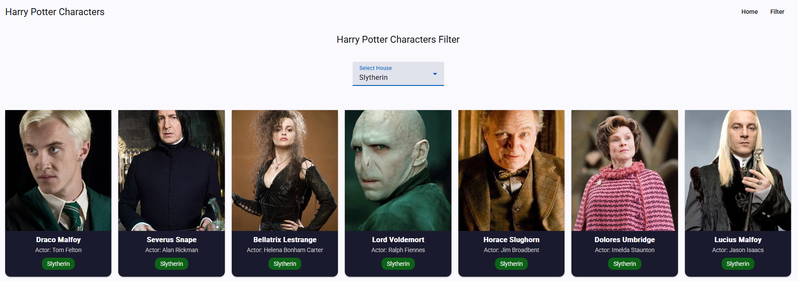
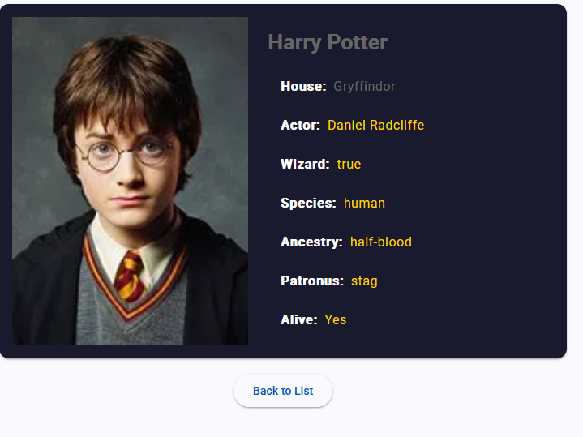

# Harry Potter Character Explorer

An Angular application that displays Harry Potter characters using the HP API. Users can browse all characters, filter them by Hogwarts house, and view detailed information about each character.

## Features

- **Character List:** Displays all Harry Potter characters with their name, house, and image.
  
- **Filter by House:** Dropdown menu to filter characters by Hogwarts house (Gryffindor, Slytherin, Hufflepuff, Ravenclaw).
  
- **Character Details:** Displays detailed information for a selected character including species, ancestry, wand details, actor name, and more.
  
- **Angular Material UI:** Uses Angular Material components for a clean and consistent design.

## API

This project uses the Harry Potter API: https://hp-api.onrender.com

## Prerequisites

- Node.js (v18 or higher)
- Angular CLI

## How to Run

```bash
ng serve
```

4. Open your browser and go to http://localhost:4200
